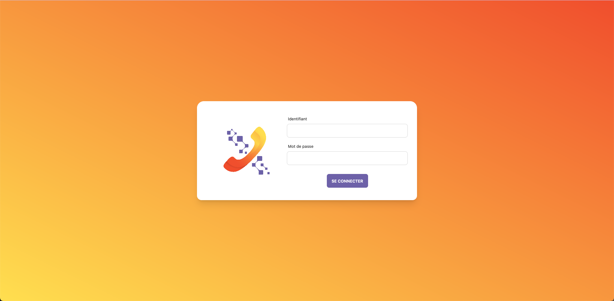

<h2 align="center">
  Prospectix 
  <a href="https://bgonzva.com/" target="_blank">bgonzva.com</a>
</h2>

  

<h3 align="center">
    🔹
    <a href="https://github.com/avznog/prospectix/issues">Report Bug</a> &nbsp; &nbsp;
    🔹
    <a href="https://github.com/avznog/prospectix/issues">Request Feature</a>
</h3>

## TL;DR

You can fork this repo to modify and make changes of your own. Please give me proper credit by linking back to [avznog](https://github.com/avznog/prospectix). Thanks!

## Built with
Prospectix is a tool I built for Junior ISEP, a "Junior-Entreprise" I worked for as a Tech Lead. It is a Customer Relationship Management Software (CRM). The goal of the software is to help the project managers of the company to acquire new clients. To do so, they rely on telemarketing. Prospectix allows them to quickly walk through a huge database of prospects. The tool helps the project manager throughout the entire process, from the first call to the client, to the appointment.

### Features
**🔍 Keep track of your prospects with the pre-built categories !**

**✉️ Log-in with Google to create and send mail templates faster than ever to your prospects or add your appointments directly in your Google Agenda**

**📊 Keep a record of your activities in the statistics tab**

**👥 Manage your project manager team by giving them Goals, and keeping track of their progress through the week**

**🌼 Work in a bit of fun and explore all the themes offered by DaisyUI !**

## Technical Stack
Prospectix is developed in AngularJS for the front-end and NestJS for the Back-End, both using TypeScript. The front-end uses daisyUI and the back-end uses TypeORM to communicate with the PostgreSQL database.

It uses `yarn` as a package manager for both the front-end and the back-end.

## Getting started

Clone down this repository. You will the repos for the front-end (prospectix-front) and for the back-end (prospectix-back). 

## Installation and setup instructions

1. Installation : `yarn` in both repositories
2. Add in the back-end repository the `.env` file. You'll need the following variables:
  - POSTGRES_PORT=5432
  - POSTGRES_PASSWORD=postgrespw
  - JWT_ACCESS_TOKEN_SECRET=access token secret
  - JWT_ACCESS_TOKEN_EXPIRATION_TIME=3600
  - JWT_REFRESH_TOKEN_SECRET=refresh token secret
  - JWT_REFRESH_TOKEN_EXPIRATION_TIME=604800
  - BASE_URL=http://localhost:4200
  - TZ=Europe/Paris
  - CREDENTIALS_PATH=/src/yourgoogleprojectcredentials.json
  - SENTRYDSN=https://yoursentydsn
  - CALENDAR_RDV_ID=yourgooglecalendarid
  - CALENDAR_TABLE_ID=yourgooglecalendarid

3. You need to setup a PostgreSQL database. You will need a project-manager lign to be able to login
4. In the front-end repository, you can run : `ng s`
5. In the back-end repository, you can run : `yarn start`

Runs the app in development mode?
Open http://localhost:4200 to view it in the browser. The page will reload if you make edits.
You can access the swagger if you go on http://localhost:3000/swagger-api
